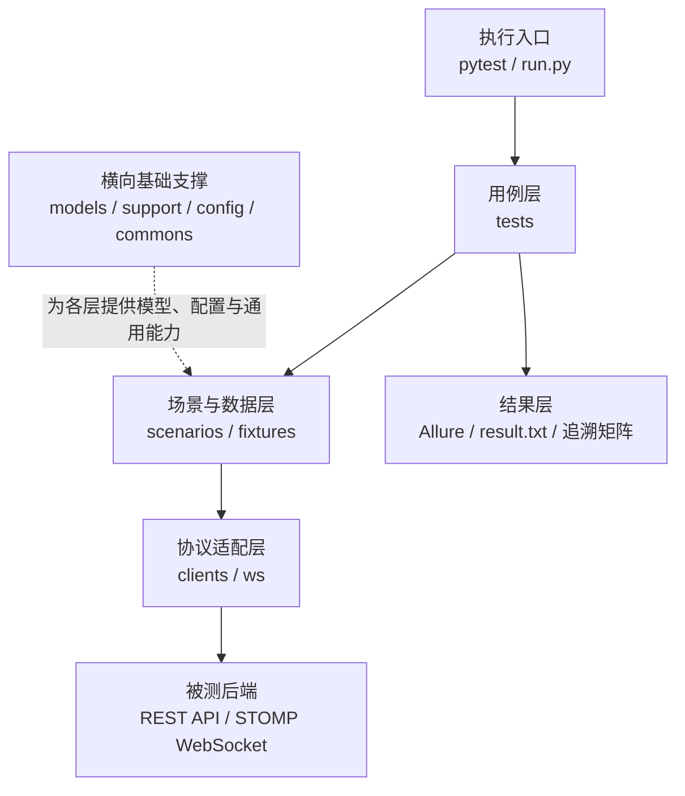
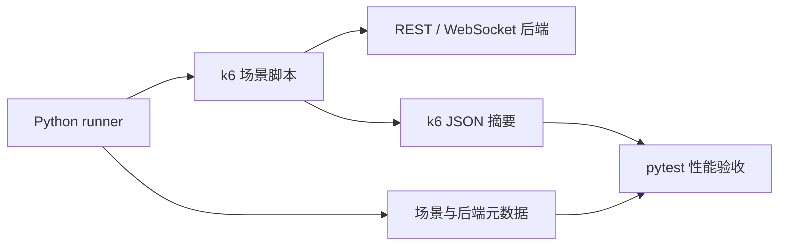
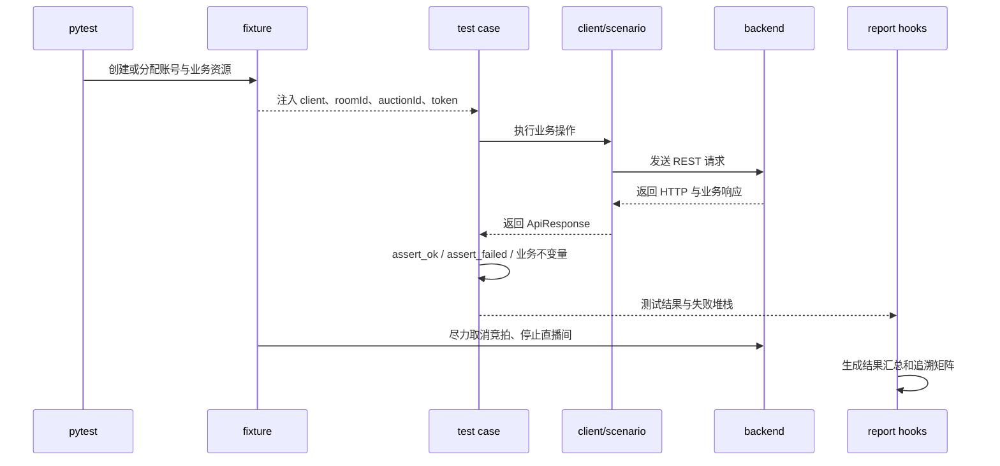

# 直播竞拍平台自动化测试项目理解

> 文档状态：与当前源码同步（2026-08-11）
> 适用项目：`live_auction_qa`
> 目标读者：测试开发、后端开发、项目维护者及首次接手项目的成员

## 1. 文档定位

本文用于建立对 `live_auction_qa` 的统一认识，重点回答以下问题：

- 这个项目测试什么，不测试什么；
- 框架由哪些层组成，各层负责什么；
- 一条测试从 pytest 收集到请求发送、断言、清理和报告生成，经历了什么；
- REST、WebSocket、确定性并发和 k6 性能测试如何协作；
- 测试账号、直播间、竞拍和出价数据如何创建、复用及清理；
- 新增接口、新增业务场景或排查失败时，应从哪里开始；
- 当前框架有哪些明确限制，哪些现象不能简单归因于测试代码。

可执行用例的逐项清单见 [`直播竞拍平台测试用例.md`](直播竞拍平台测试用例.md)；接口形状与端点边界见 [`api-contract.md`](api-contract.md)。

本文描述的是当前代码实际行为，不把设想、历史方案或尚未实现的能力写成现有功能。

## 2. 项目概览

### 2.1 项目目标

`live_auction_qa` 是直播竞拍后端的独立自动化测试项目，围绕竞拍业务主链路提供以下验证能力：

- REST API 功能与业务状态验证；
- STOMP over WebSocket 实时事件验证；
- Python 线程驱动的可控并发竞争验证；
- k6 驱动的负载、竞争、重复出价、WebSocket 和混合压力验证；
- Allure 报告、执行结果汇总和 Case ID 追溯矩阵生成。

### 2.2 当前测试范围

项目当前包含八个测试域：

当前源码登记 74 个稳定 Case ID，pytest 收集 128 个执行项。查询与数据一致性通过各业务域的详情、列表、排名和记录断言完成，不单独设立 `DATA` 测试域。

| 测试域 | 主要职责 |
| --- | --- |
| health | 验证后端服务是否可访问 |
| auth | 注册、登录、缺字段、重复用户名和无 Token 鉴权 |
| room | 直播间创建、修改、开播、下播、查询和归属权限 |
| auction | 竞拍创建、修改、开始、取消、查询和状态限制 |
| bid | 出价金额规则、精度、请求参数和竞拍状态限制 |
| ws | 实时事件、在线人数、订阅隔离和身份安全 |
| concurrency | 相同价格竞争、重复出价和陈旧价格竞争 |
| perf | k6 负载、竞争、重复轮次、WebSocket 和混合压力结果验收 |

订单和支付业务不在当前测试范围内，项目中不保留订单客户端及订单测试域。

### 2.3 被测系统边界

测试框架通过以下入口与后端交互：

- HTTP：默认地址 `http://localhost:8080`；
- WebSocket：默认地址 `ws://localhost:8080/ws/websocket`；
- STOMP 应用出价目的地：默认 `/app/bid`；
- k6：调用与功能测试相同的 HTTP、WebSocket 和 STOMP 接口。

框架不直接访问数据库，也不通过数据库检查业务结果。所有结果判断均来自公开接口、管理接口、竞拍详情、出价记录、排名和实时消息。

## 3. 总体架构

### 3.1 分层关系

功能测试与性能测试的执行方式不同，分别展示可以避免把两条链路混在一张图中。

#### 功能测试分层



主链路从上到下：pytest 收集测试，用例通过场景和 fixture 建立前置条件，再经 REST 或 WebSocket 适配层访问后端。基础支撑模块不主导业务流程，只向其他层提供公共能力。

#### 性能测试链路



性能链路独立于功能测试 fixture：runner 负责准备数据和注入参数，k6 负责产生负载，pytest 只验收结果来源、业务 checks 和性能阈值。

### 3.2 分层原则

项目采用“测试表达业务、客户端封装协议、场景封装流程、支持层提供通用能力”的分工：

- 测试文件负责描述前置条件、操作、业务预期和不变量；
- `clients/` 负责 URL、HTTP 方法、请求参数和响应包装；
- `ws/` 负责 STOMP 连接、订阅确认、消息接收和事件匹配；
- `scenarios/` 负责跨多个接口的业务生命周期组合；
- `support/` 负责断言、并发、时间、等待、用户池和追溯；
- `fixtures/` 负责测试依赖创建、复用和尽力清理；
- `load/` 独立负责 k6 场景调度、结果来源校验和摘要生成。

## 4. 目录职责

| 路径 | 职责 | 不应承担的职责 |
| --- | --- | --- |
| `clients/` | 封装 REST 接口和统一响应对象 | 编写跨接口业务流程和业务断言 |
| `commons/` | 配置、日志、Allure 报告辅助 | 保存具体竞拍业务规则 |
| `config/` | 默认配置 | 保存运行产生的数据 |
| `models/` | 稳定状态、角色、事件类型和请求 Payload | 固化不稳定错误码 |
| `scenarios/` | 可复用业务生命周期和竞拍等待逻辑 | 生成测试报告 |
| `support/` | 断言、并发、时间、等待、追溯和用户池 | 拼接具体接口 URL |
| `tests/fixtures/` | pytest fixture、资源追踪和清理 | 编写独立测试用例 |
| `tests/` | 八个业务测试域 | 重复实现客户端和通用工具 |
| `ws/` | STOMP 客户端和事件谓词 | 直接组织完整竞拍生命周期 |
| `load/` | k6 场景、运行、摘要和来源校验 | 代替确定性的功能断言 |
| `docs/` | 测试用例清单、项目理解和接口契约 | 保存临时执行结果 |
| `reports/` | Allure、k6、追溯和用户池等运行产物 | 保存需要版本管理的源代码 |

## 5. 核心执行链路

### 5.1 pytest 功能测试链路



### 5.2 `run.py` 一键执行链路

`run.py` 是完整回归入口，执行顺序为：

1. 从项目根目录运行 `pytest`；
2. pytest 将 Allure 原始结果写入 `reports/temps`；
3. pytest 结束后生成执行统计和追溯矩阵；
4. 测试配置为 Allure 时，调用 Allure CLI 生成静态报告；
5. 修改 Allure 报告标题和摘要名称；
6. pytest 或 Allure 任一阶段失败，最终进程返回非零退出码。

### 5.3 WebSocket 验证链路

WebSocket 用例不是简单等待任意消息，而是：

1. 使用 Token 建立 STOMP 连接；
2. 订阅竞拍 Topic 或用户 Queue；
3. 请求 STOMP receipt，但不阻塞等待；当前后端不返回确认帧；
4. 通过 REST 或 STOMP 触发业务动作；
5. 使用事件谓词匹配指定竞拍、房间、用户、价格和事件类型；
6. 查询 REST 终态，联合验证“推送正确”和“业务数据正确”；
7. 断开连接并释放资源。

### 5.4 Python 并发验证链路

确定性并发用例通过统一起跑栅栏让多个线程尽量同时发出请求。执行器使用全局截止时间等待线程完成，并将仍存活的线程明确记录为 `TimeoutError`，避免把线程卡死误认为正常业务拒绝。

### 5.5 k6 性能验证链路

k6 链路分为准备、执行、记录和验收四个阶段：

1. Python runner 准备用户、直播间和竞拍数据；
2. runner 向 k6 注入后端地址、Token 文件、竞拍 ID 和 STOMP 目的地；
3. k6 执行场景并输出 JSON summary；
4. Python 记录后端身份、运行时间和场景元数据；
5. pytest 性能用例检查结果新鲜度、场景匹配、业务 checks、错误率及响应时间阈值。

## 6. 配置体系

### 6.1 配置来源与优先级

配置采用统一覆盖顺序：

```text
进程环境变量 > 项目根目录 .env > config/config.yaml
```

该规则使本地默认配置、开发者私有配置和 CI/部署环境配置可以共存，同时避免修改源码切换环境。

### 6.2 主要配置类别

- HTTP 与 WebSocket 地址；
- HTTP 请求超时；
- 默认测试密码；
- STOMP receipt、消息等待和心跳参数；
- STOMP 出价目的地；
- k6 可执行文件位置；
- 测试报告类型；
- 日志级别和输出格式。

### 6.3 配置使用原则

- 地址、超时和工具路径不得在测试文件中散落硬编码；
- 新增可配置项时，应先确定唯一消费方；
- 仅写入配置但没有代码读取的字段不属于有效配置；
- 敏感账号和 Token 不应提交到默认配置文件。

## 7. REST 客户端层

### 7.1 `ApiClient`

`clients/base.py` 提供统一 HTTP 会话和响应包装，负责：

- 拼接基础 URL；
- 自动附带 Authorization；
- 设置统一超时；
- 发出 GET、POST、PUT、DELETE 请求；
- 将 HTTP 状态、响应头、原始文本和 JSON 数据包装为 `ApiResponse`；
- 将请求及响应信息附加到 Allure 报告。

### 7.2 领域客户端

领域客户端按资源拆分：认证、直播间、竞拍、出价和健康检查。测试用例应优先调用领域客户端，只有在“缺字段、非法类型、畸形请求”等正常客户端无法表达的协议负向场景中，才直接调用 `ApiClient`。

### 7.3 响应成功判定

成功响应需要同时满足传输层和业务响应要求。负向场景不绑定不稳定的具体 HTTP 状态或业务错误码，而是通过 `assert_failed` 判断请求没有成功，并进一步验证业务状态没有产生不应有的变化。

## 8. 模型与 Payload

`models/` 只保存相对稳定、能够跨用例复用的业务表达：

- 直播间、竞拍等状态枚举；
- 用户角色；
- WebSocket 事件类型；
- 竞拍创建和修改 Payload builder；
- 默认竞拍价格、加价幅度和时间配置。

金额边界测试优先使用字符串或 `Decimal` 表达，避免二进制浮点误差破坏 `0.01`、最小加价和封顶价格等精确边界。

## 9. 场景层

场景层用于封装必须跨多个接口才能建立的业务前置条件，例如：

- 注册主播；
- 创建并启动直播间；
- 创建待开始竞拍；
- 启动竞拍；
- 创建出价用户并完成一次有效出价；
- 等待竞拍进入指定剩余时间窗口。

场景层返回后续断言需要的上下文，但不替测试用例决定业务预期。测试标题、Case ID、关键操作和最终断言仍保留在测试层。

## 10. Fixture 与测试数据生命周期

### 10.1 Fixture 分工

`tests/conftest.py` 只负责注册 fixture 插件，具体 fixture 分为：

- `users.py`：用户池、匿名客户端、主播客户端和出价用户工厂；
- `resources.py`：本轮创建资源的登记与尽力清理；
- `lifecycle.py`：直播间、待开始竞拍、进行中竞拍和带出价人的生命周期前置条件。

### 10.2 用户策略

- 普通出价用户通过 session 级用户池复用；
- 用户分配器不会在同一轮测试中循环复用相同身份；
- 用户池不足时动态注册并扩容；
- 登录、重复用户名和用户历史记录等身份敏感场景创建独立用户；
- 主播通常独立创建，避免后端“一名主播只能创建一个房间”等限制造成污染。

### 10.3 清理能力与限制

fixture 结束时会尽力取消尚未结束的竞拍并停止直播间。由于后端没有用户、房间和竞拍物理删除接口，框架只能清理活动状态，不能彻底清除历史记录。因此列表和历史类测试不能依赖数据库总量，必须匹配本轮创建的资源 ID 或唯一名称。

## 11. 断言策略

### 11.1 正向断言

正向用例通常依次验证：

1. 请求成功；
2. 返回数据包含关键字段；
3. 返回值满足业务规则；
4. 再次查询后的持久化终态正确；
5. 需要实时通知时，对应 WebSocket 事件正确。

### 11.2 负向断言

由于后端错误状态码和业务错误码不稳定，负向用例不把某个固定错误码作为主要契约，而是验证：

- 请求没有成功；
- 未签发 Token；
- 未创建资源；
- 竞拍状态没有非法改变；
- 当前价、出价次数和出价记录没有变化；
- 没有产生错误的 WebSocket 副作用。

`assert_failed` 负责统一判断“请求被拒绝”，业务不变量由测试用例根据场景单独断言。

### 11.3 最终状态优先

只验证单次响应不足以证明业务正确。竞拍、出价、直播间和并发测试应尽量通过详情、列表、记录、排名或事件查询确认最终状态。

## 12. 测试用例组织

### 12.1 文件拆分原则

- 认证域按注册、登录、参数和鉴权组织；
- 直播间域拆分为生命周期和校验；
- 竞拍域拆分为生命周期和校验；
- 出价域拆分为金额规则和状态限制；
- WebSocket 域拆分为事件、在线人数和安全；
- 并发与性能测试独立成域。

### 12.2 Case ID

每个业务用例通过 `@case("域-类型-编号")` 注册稳定 Case ID。参数化测试可以生成多个 pytest 执行项，因此 Case ID 数量与实际执行项数量并不相同。

当前源码包含 74 个业务 Case ID，pytest 共收集 128 个执行项。

[`直播竞拍平台测试用例.md`](直播竞拍平台测试用例.md) 只列当前源码实际登记的 Case ID，并记录参数化合并关系。新增、拆分或合并 Case ID 时，应同步更新该清单。

### 12.3 标记体系

pytest marker 用于按测试域和执行特征筛选，例如 `auth`、`room`、`auction`、`bid`、`ws`、`concurrency`、`perf`、`slow` 和 `stress`。

## 13. WebSocket 事件模型

`ws/events.py` 提供事件谓词，用于从异步消息流中匹配目标消息。谓词按事件类型及关键业务字段过滤，防止“收到一条消息”被误认为“收到正确消息”。

主要事件包括：

- 竞拍开始；
- 出价广播；
- 延时；
- 成交；
- 取消；
- 自然结束；
- 被超价通知；
- 在线人数变化。

用户私有通知与房间广播使用不同订阅目的地，安全用例同时验证无效 Token、跨房间订阅和身份伪造行为。

## 14. 并发与性能测试

### 14.1 Python 并发与 k6 的区别

| 类型 | 主要目标 | 特点 |
| --- | --- | --- |
| Python 并发 | 验证少量请求竞争下的业务原子性 | 起跑可控、结果可逐线程分析 |
| k6 负载 | 验证多虚拟用户下的稳定性和响应时间 | 用户量更大、指标聚合、适合持续负载 |
| k6 WebSocket | 验证连接、订阅、出价和广播完整链路 | 同时关注消息正确性和广播延迟 |

### 14.2 当前性能验收维度

- 网络和服务端错误率；
- 业务 checks；
- HTTP 请求时延 p95；
- WebSocket 出价后广播时延 p95；
- 竞拍最终价格、出价次数和记录数量；
- k6 结果是否来自正确场景、当前后端和允许的时间范围。

### 14.3 结果来源保护

每个 k6 JSON 摘要配套同名元数据文件，记录场景、执行时间和后端身份。pytest 在读取结果前先验证这些信息，避免把旧文件或其他后端版本的结果当作本次结果。

## 15. 报告与追溯

### 15.1 Allure

Allure 原始数据写入 `reports/temps`，静态报告写入 `reports/allures`。接口请求、响应和失败堆栈作为附件进入报告，便于从失败用例直接定位交互过程。

### 15.2 文本结果

pytest 正常执行结束后，`reports/result.txt` 汇总执行项总数、通过、失败、跳过、错误、时长和成功率。`--collect-only` 不生成执行结果，避免把“仅收集”误写成一次失败回归。

### 15.3 追溯矩阵

- `traceability.md`：扫描完整测试源码生成的完整 Case ID 矩阵；
- `traceability-current.md`：本次实际导入和执行范围的矩阵；
- Case ID 重复时直接报错，避免静默覆盖。

## 16. 失败诊断路径

排查失败时建议按以下顺序定位：

1. 确认 HTTP 后端和 WebSocket 地址是否正确；
2. 单独执行健康检查，区分连接失败和业务失败；
3. 查看失败堆栈、HTTP 原始响应和请求参数；
4. 判断失败发生在 fixture、业务调用、断言还是清理阶段；
5. 对负向用例检查是“请求意外成功”还是“业务不变量被破坏”；
6. 对 WebSocket 用例检查连接、receipt、事件触发和消息谓词；
7. 对并发用例区分业务拒绝、线程异常和线程超时；
8. 对性能用例先检查结果元数据，再检查阈值和业务终态。

不应仅根据 pytest 最后一行的 fixture 参数展示判断失败原因，真实断言信息和异常堆栈位于失败详情中。

## 17. 当前限制与使用边界

- 后端缺少测试数据物理删除接口，历史数据会持续保留；
- 后端负向响应的 HTTP 状态码和业务码不稳定；
- WebSocket 和竞拍延时用例受服务端定时任务及网络调度影响；
- 性能用例依赖独立安装的 k6；
- Allure 静态报告生成依赖独立安装的 Allure CLI；
- 性能 pytest 负责验收已有 k6 结果，不等价于每次 pytest 都自动执行全部压力场景；
- CI 尚未加入项目，当前执行入口为本地 pytest、`run.py` 和 k6 runner。

## 18. 扩展项目的基本规则

### 18.1 新增 REST 接口

1. 在对应领域客户端增加方法；
2. 必要时增加稳定枚举或 Payload builder；
3. 在相应业务域增加带 Case ID 的测试；
4. 同时考虑正向终态、负向副作用和权限边界；
5. 运行收集检查，确认 Case ID 没有重复。

### 18.2 新增 WebSocket 事件

1. 在事件枚举中增加稳定类型；
2. 在 `ws/events.py` 增加谓词；
3. 明确广播 Topic 或用户 Queue；
4. 请求订阅 receipt 但不把确认帧作为前置条件，通过事件和 REST 终态验证订阅结果；
5. 同时使用 REST 查询验证最终状态。

### 18.3 新增性能场景

1. 在 `load/k6/` 增加脚本；
2. 在场景注册表声明名称、脚本和准备方式；
3. 由 runner 注入运行参数并写入元数据；
4. 在 `tests/perf/` 增加结果验收；
5. 明确业务 checks、错误率、响应时间和最终状态阈值。

## 19. 推荐阅读顺序

首次接手项目时，建议按以下顺序阅读：

1. `README.md`：了解安装、运行和主要约束；
2. `docs/直播竞拍平台测试用例.md`：了解当前 72 个稳定 Case ID 及参数化覆盖；
3. `docs/api-contract.md`：了解接口来源、端点和协议形状；
4. `config/config.yaml` 与 `commons/yaml_util.py`：了解运行配置；
5. `clients/base.py`：了解请求和响应模型；
6. `tests/fixtures/`：了解账号、资源和生命周期如何建立；
7. `scenarios/auction_lifecycle.py`：了解完整业务前置链；
8. 各测试域：理解业务规则和实际契约；
9. `ws/stomp_client.py` 与 `ws/events.py`：理解实时消息验证；
10. `support/assertions.py`、`concurrency.py` 和 `traceability.py`：理解通用保障；
11. `load/`：理解性能场景、结果和来源校验；
12. `conftest.py` 与 `run.py`：理解测试运行和报告收尾。

## 20. 常用命令

```powershell
# 仅收集，不访问后端
python -m pytest --collect-only -q

# 健康检查
python -m pytest tests/health -v

# 按测试域执行
python -m pytest tests/auth tests/room tests/auction tests/bid -v

# 执行 WebSocket 与确定性并发
python -m pytest tests/ws tests/concurrency -v

# 一键完整执行并生成 Allure 报告
python run.py

# 运行有限并发正确性场景并验收结果
python -m load.concurrency.runner --scenario bid_concurrent
python -m pytest tests/concurrency -v

# 运行性能稳定性场景并验收结果
python -m load.performance.runner --scenario mixed_stress
python -m pytest tests/perf -v
```

## 21. 术语

| 术语 | 含义 |
| --- | --- |
| 主播 / merchant | 创建并管理直播间和竞拍的用户 |
| 出价用户 / bidder | 参与竞拍并提交价格的普通用户 |
| Pending | 竞拍已创建但尚未开始 |
| Live | 竞拍正在进行 |
| Sold | 达到成交条件后的终态 |
| Cancelled | 竞拍被取消后的终态 |
| Case ID | 稳定标识一个业务测试意图的编号 |
| pytest 执行项 | pytest 实际运行的测试实例，参数化后一个 Case ID 可对应多个执行项 |
| receipt | STOMP 服务端对订阅等操作的确认帧 |
| 业务不变量 | 负向请求后必须保持不变的价格、次数、状态、记录等数据 |
| provenance | k6 结果的场景、时间和后端来源信息 |
