# 项目梳理

## 目录

- [一、HTTP 传输层（clients/）](#一http-传输层clients)
- [二、断言与数据模型](#二断言与数据模型)
- [三、通用工具（support/）](#三通用工具support)
- [四、业务编排（scenarios/）](#四业务编排scenarios)
- [五、WebSocket 实时通信（ws/）](#五websocket-实时通信ws)
- [六、测试夹具（tests/fixtures/）](#六测试夹具testsfixtures)
- [七、性能测试（load/）](#七性能测试load)

---

# 一、HTTP 传输层（clients/）

本层封装所有 HTTP 请求的传输细节：连接池、鉴权、URL 拼接、超时、日志、Allure 埋点、JSON 解析。上层只管"调哪个接口、传什么参数、断言什么"。

## clients/base.py —— HTTP 传输层基座

**定位**：所有 HTTP 调用的统一出入口。上层 5 个资源客户端（`AuthClient` / `RoomClient` / `AuctionClient` / `BidClient` / `HealthClient`）都通过它发请求，下层对接后端 HTTP。

### 一、三个核心组件

| 组件 | 角色 | 一句话 |
|---|---|---|
| `ApiResponseError` | 异常标志 | 传输层 / JSON 解析失败的信号 |
| `ApiResponse` | 响应数据 | 一次响应的结构化快照 |
| `ApiClient` | 请求执行者 | 把"发请求 → 拿响应"封装成一步 |

#### 1. `ApiResponseError` —— 传输异常

继承自 `RuntimeError`，**空实现**（只有 docstring）。

> 🔑 **为什么空**：不为新行为，只为新类型。让 `try/except ApiResponseError` 能**精确捕获**"传输层 / JSON 解析失败"，不误抓其他 `RuntimeError`。

#### 2. `ApiResponse` —— 响应模型

`@dataclass`，5 个字段记录一次响应：

| 字段 | 含义 |
|---|---|
| `http_status` | HTTP 状态码 |
| `code` | 业务码（200 / 401 / 1001 ...） |
| `message` | 业务消息 |
| `data` | 业务数据 |
| `raw` | 原始 `requests.Response` |

两个派生属性（`@property`）：

| 属性 | 行为 | 备注 |
|---|---|---|
| `is_ok` | `HTTP=200 且 code=200` 双重判定 | 成功必须**同时**满足 HTTP 和业务两层 |
| `biz_code` | 成功返回 `None`，失败返回原 `code` | 用于诊断，**不用于断言** |

#### 3. `ApiClient` —— 请求执行者

封装了一次 HTTP 请求从发起到拿到结构化响应的**全部传输层关注点**：

> 连接池 / 鉴权 / URL 拼接 / 超时 / 日志 / Allure 埋点 / JSON 解析 / 业务信封拆封

构造时建立的状态：`session`（连接池）/ `token`（鉴权上下文）/ `base_url` / `timeout` / `user_id` / `username`。

---

### 二、三者怎么协作（关键）

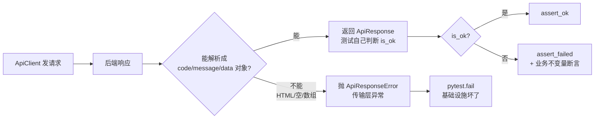

> ⚠️ **特别注意：业务失败不抛异常**
>
> 这是整个传输层最重要的边界。
>
> | 情况 | 走向 | 含义 |
> |---|---|---|
> | 后端返回 HTML / 非 JSON / JSON 数组 | 抛 `ApiResponseError` | 测试基础设施坏了 |
> | 后端正常返回 `{code: 1001, ...}` 业务失败 | 返回 `ApiResponse`（`is_ok=False`） | 被测系统拒绝了请求 |
>
> 这条边界让"**基础设施坏了**"和"**被测系统拒绝请求**"在测试层完全分开，不会混淆。

---

### 三、一次请求的完整链路

以"注册用户"为例，从测试用例到后端再到断言：

```text
AuthClient.register()
    │
    │ 构造 json body
    ▼
ApiClient.post("/api/auth/register", name="注册", json={...})
    │
    ▼
ApiClient._request("POST", "/api/auth/register", ...)
    │
    ├─ 105: url = "http://localhost:8080/api/auth/register"
    ├─ 106: timeout 注入
    ├─ 107: headers 拷贝
    ├─ 108-109: Authorization 注入（如有 token）
    ├─ 110: info_log("[POST] http://localhost:8080/api/auth/register")
    ├─ 111: requests.Session.request(...)  → 后端
    │                                          │
    │ ◄────────────────────────────────────────┘
    ├─ 112: _attach(...)  → 7 类信息进 Allure
    └─ 113: _wrap(resp)   → ApiResponse(http_status=200, code=200, data={...})
                │
                ▼
            返回给 AuthClient.register() → 返回给测试用例
                │
                ▼
            assert_ok(resp, "注册普通用户")
```

## clients/auth_client.py —— 认证客户端

**定位**：封装"注册 + 登录"两个接口，以及一套围绕账号创建的辅助函数。是测试拿到鉴权上下文（token / userId）的入口。

### 一、两个核心部分

| 部分 | 角色 |
|---|---|
| `AuthClient` 类 | 薄客户端，封装 register / login 两个接口 |
| 模块级辅助函数 | 围绕账号创建的便利函数（注册+登录、JWT 解码、用户名生成等） |

### 二、AuthClient 类

两个方法，都是薄包装：

| 方法 | HTTP | body 字段 |
|---|---|---|
| `register(username, password, role, nickname=None)` | POST `/api/auth/register` | username / password / nickname / role |
| `login(username, password)` | POST `/api/auth/login` | username / password |

### 三、模块级辅助函数

| 函数 | 作用 |
|---|---|
| `unique_username(prefix)` | 生成 `{prefix}_{uuid4 前 8 位}` 唯一用户名 |
| `default_password()` | 读 `ACCOUNT.default_password` 配置，默认 `123456` |
| `get_token(client)` | 取 `client.token or ""` |
| `decode_jwt_payload(token)` | base64 解码 JWT 中段，返回 claims dict |
| `register_account(role, username, password)` | **核心**：注册 + 登录一步完成，返回 `{username, userId, token, role}` |
| `register_client(role, username, password)` | 在 register_account 基础上构造带 token 的 `ApiClient` |
| `register_merchant(...)` | `register_client(role=1)` 造主播 |
| `register_bidder(...)` | `register_client(role=2)` 造竞拍者 |

### 四、核心流程：register_account 的两步合一

测试拿 token 的标准入口。把"注册 + 登录 + 取 token + 取 userId"封装成一个动作，内部有 **3 个失败抛异常点** + **1 个兜底逻辑**：

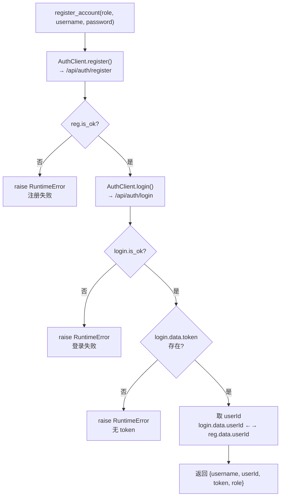

### 五、关键边界

> ⚠️ **特别注意：`decode_jwt_payload` 不验签**
> 只做 base64 解码，不验证 JWT 签名。给测试断言 `sub / role / exp` 用，**不能用于"验证 token 真伪"**。

> ⚠️ **特别注意：`register_account` 三个失败点抛 `RuntimeError`**
> 注册失败 / 登录失败 / 登录响应无 token，三种情况都抛异常。调用方不需要自己判断 `is_ok`，但要知道这些异常意味着"**测试前置失败**"，不是被测系统的业务拒绝。

> 🔑 **userId 兜底逻辑**（[auth_client.py:72](file:///d:/project/live_auction_qa/clients/auth_client.py)）
> `user_id = (login.data or {}).get("userId") or (reg.data or {}).get("userId")`
> 登录响应里有 userId 就用登录的，没有就回退到注册响应。这是对**后端响应字段不稳定**的容错。

## clients/room_client.py —— 直播间客户端

**定位**：直播间管理客户端，8 个方法，分主播后台（6 个）和用户公开（2 个）两组。覆盖直播间的创建、开播、下播、修改、查询，以及公开的房间列表和在线人数。

### 一、8 个方法清单

**主播后台**（需要 merchant token）：

| 方法 | HTTP | 路径 | 参数 |
|---|---|---|---|
| `create(title, cover_image, video_url, notice)` | POST | `/api/admin/room` | **`params`**（非 JSON body），仅传非 None 字段 |
| `start(room_id)` | POST | `/api/admin/room/{id}/start` | 无 |
| `stop(room_id)` | POST | `/api/admin/room/{id}/stop` | 无 |
| `update(room_id, title, cover_image, video_url, notice)` | PUT | `/api/admin/room/{id}` | **`params`**，仅传非 None 字段 |
| `get_my_room()` | GET | `/api/admin/room` | 无 |
| `get_live_rooms()` | GET | `/api/admin/room/live` | 无 |

**用户公开**：

| 方法 | HTTP | 路径 |
|---|---|---|
| `public_list()` | GET | `/api/rooms` |
| `online_count(room_id)` | GET | `/api/rooms/{id}/online` |

### 二、直播间状态机

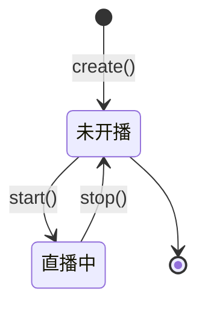

### 三、关键边界

> 🔑 **部分提交**
> `create` 和 `update` 只传非 None 的字段。`update` 的 `title` 也是可选的 —— 因为可能只想改 notice 不改 title。

## clients/auction_client.py —— 竞拍客户端

**定位**：竞拍管理客户端，9 个方法，分主播后台（6 个）和用户公开（3 个）两组。覆盖竞拍的创建、修改、开始、取消、详情、列表、排行榜。

### 一、9 个方法清单

**主播后台**（需要 merchant token）：

| 方法 | HTTP | 路径 | 参数 |
|---|---|---|---|
| `admin_create(payload)` | POST | `/api/admin/auction` | JSON body（payload 由 [models/payloads.py](file:///d:/project/live_auction_qa/models/payloads.py) 构造） |
| `admin_update(auction_id, payload)` | PUT | `/api/admin/auction/{id}` | JSON body |
| `admin_start(auction_id)` | POST | `/api/admin/auction/{id}/start` | 无 |
| `admin_cancel(auction_id, reason)` | POST | `/api/admin/auction/{id}/cancel` | `reason` 走 query param |
| `admin_detail(auction_id)` | GET | `/api/admin/auction/{id}` | 无 |
| `admin_list(page, size)` | GET | `/api/admin/auctions` | `page/size` 走 query param |

**用户公开**（无需鉴权或普通用户 token）：

| 方法 | HTTP | 路径 |
|---|---|---|
| `public_detail(auction_id)` | GET | `/api/auction/{id}` |
| `room_auctions(room_id)` | GET | `/api/room/{id}/auctions` |
| `ranking(auction_id)` | GET | `/api/auction/{id}/ranking` |

### 二、竞拍状态机

哪些方法触发状态转换，哪些由后端自动触发：

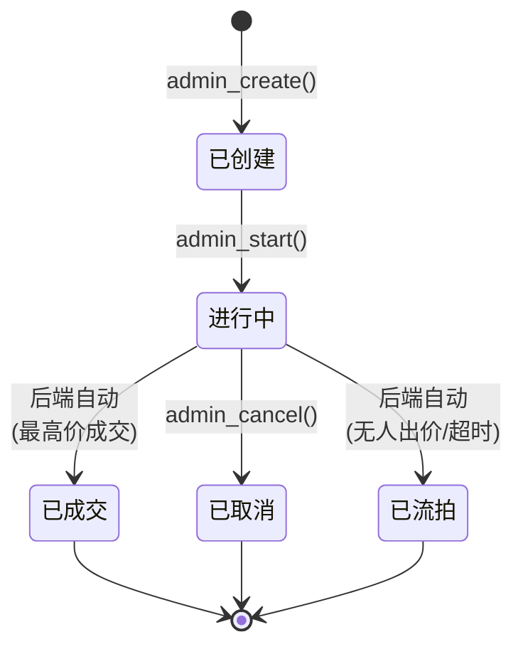

### 三、关键边界

> 🔑 **payload 不在客户端构造**
> `admin_create(payload)` 接受外部传入的 `Mapping[str, Any]`，不自己构造默认 payload。payload 由 [models/payloads.py](file:///d:/project/live_auction_qa/models/payloads.py) 的 `default_auction_payload()` 生成。客户端只管传输，不管业务默认值。

## clients/bid_client.py —— 出价客户端

**定位**：出价客户端，只有 2 个方法，是最薄的客户端。但 `bid` 方法藏着一个反直觉的后端约定。

### 一、2 个方法

| 方法 | HTTP | 路径 | 参数 |
|---|---|---|---|
| `bid(auction_id, amount)` | POST | `/api/auction/{id}/bid` | **amount 走 query param** |
| `my_bids()` | GET | `/api/user/bids` | 无 |

### 二、关键边界

> 🔑 **`my_bids` 的双重身份**
> `GET /api/user/bids` 不仅是测试用例的"我的出价记录"接口，还被 [support/user_pool.py](file:///d:/project/live_auction_qa/support/user_pool.py) 用作**用户池探活接口**（`PROBE_PATH = "/api/user/bids"`）。一个 bidder token 调它，返回 200 表示 token 有效，401 表示失效。

### 场景协同：一次完整的注册请求

以 `AUTH-NOR-001 普通用户注册成功` 为例，展示 clients 层所有组件怎么配合：

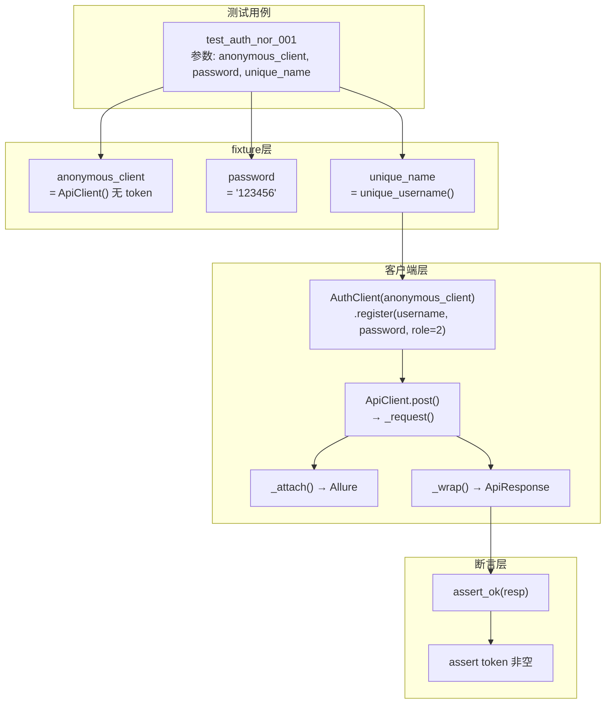

**协同要点**：
1. **fixture 提供零件**：`anonymous_client`（无 token 的 ApiClient）、`password`（配置默认密码）、`unique_name`（唯一用户名生成器）
2. **AuthClient 薄包装**：构造 JSON body（4 字段），调 `ApiClient.post()`
3. **ApiClient 全包**：拼 URL、注入 timeout、写日志、发请求、attach 到 Allure、解析响应
4. **断言层判断**：`assert_ok` 检查 `is_ok`，测试继续断言 `token` 非空（业务不变量）

---

# 二、断言与数据模型

本层定义"如何判断响应成功/失败"和"竞拍请求体长什么样"。

## support/assertions.py —— 断言工具

**定位**：统一断言模块，4 个函数针对 `ApiResponse` 做 ok / 失败 / 字段断言。每个测试都用，是 clients 的直接下游。

### 一、4 个函数

| 函数 | 作用 | 失败行为 | 典型场景 |
|---|---|---|---|
| `require_ok(resp, action)` | 造数用，成功返回 resp | **抛 `ApiResponseError`**（让测试直接挂） | fixture 造竞拍、造直播间 |
| `assert_ok(resp, action)` | 测试断言成功 | `assert` 失败（带上下文） | 正向用例 |
| `assert_failed(resp, action)` | 测试断言失败，**不绑定错误码** | `assert` 失败（带上下文） | 负向用例 |
| `assert_fields(resp, expected, msg)` | 验证 data 字段等于期望值 | `assert` 失败（字段级） | 终态断言（如 `{"status": 5, "bidCount": 0}`） |

### 二、何时用哪个函数

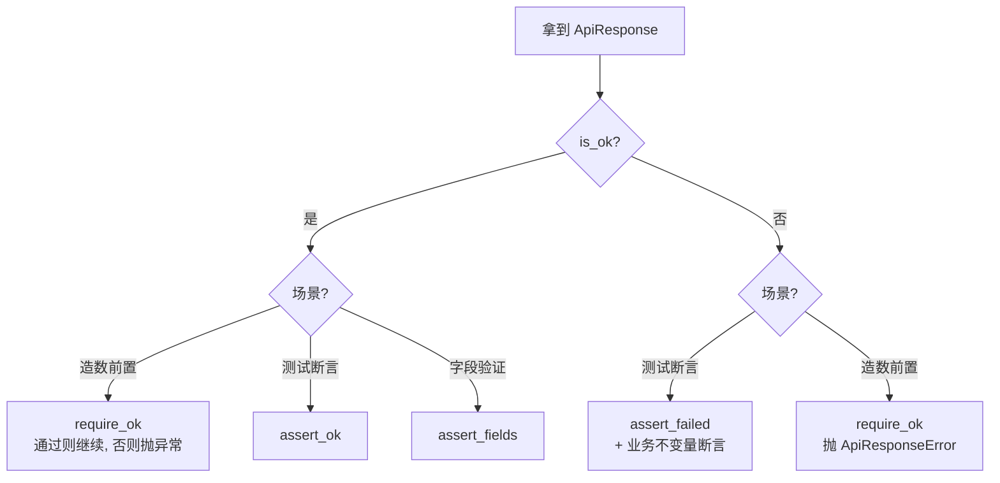

### 三、关键边界

> ⚠️ **特别注意：`assert_failed` 不绑定错误码**
> 只断言"请求未成功"（`not resp.is_ok`），不检查具体 HTTP/业务错误码。后端错误码（401/403/1001/2006）不稳定，固化会过拟合。状态码只保留在失败诊断信息里。

> 🔑 **`require_ok` vs `assert_ok` 的区别**
> - `require_ok` 失败**抛异常**（`ApiResponseError`）—— 造数失败应该让整个测试直接挂，不是断言失败
> - `assert_ok` 失败是 **`assert` 失败** —— 测试断言失败，pytest 正常记录
>
> 造数用 `require_ok`（让前置失败更显眼），测试断言用 `assert_ok`（让失败更可读）。

> 🔑 **`assert_failed` 的"两步断言"模式**
> 负向用例不能只断言"请求被拒绝"，必须继续断言**业务不变量**（如：token 未签发、资源未创建）。`assert_failed` 只是第一步，业务副作用由调用方继续断言。

## models/payloads.py —— 竞拍请求体构建器

**定位**：竞拍请求体构建器，给 `AuctionClient.admin_create(payload)` 提供默认 payload。

### 一、默认 payload 字段

`DEFAULT_AUCTION_PAYLOAD` 常量的 8 个字段：

| 字段 | 默认值 | 含义 |
|---|---|---|
| `name` | `"qa_live_auction_item"` | 商品名 |
| `description` | `"created by live_auction_qa"` | 商品描述 |
| `images` | `"https://example.com/item.png"` | 商品图片 URL |
| `startPrice` | `100` | 起拍价 |
| `incrementAmount` | `9` | 加价幅度 |
| `maxPrice` | `1000` | 封顶价 |
| `durationMinutes` | `5` | 竞拍时长（分钟） |
| `delaySeconds` | `10` | 延时窗口（秒） |

`default_auction_payload()` 函数用 `deepcopy` 返回新副本，避免共享引用。

### 二、AuctionPayload 链式 builder

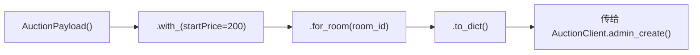

4 个方法：

| 方法 | 作用 |
|---|---|
| `__init__(**overrides)` | 初始化默认 payload + 覆盖 |
| `.with_(**overrides)` | 链式覆盖字段，返回 `self` |
| `.for_room(room_id)` | 设置 `roomId` 字段 |
| `.to_dict()` | 返回 `deepcopy`（最终输出） |

### 三、关键边界

> 🔑 **`deepcopy` 防共享引用**
> `default_auction_payload()` 和 `to_dict()` 都用 `deepcopy`。每次返回新副本，避免多个测试共享同一个 dict 引用导致互相污染。

> 🔑 **链式 builder 模式**
> `.with_().for_room().to_dict()` —— 每个方法都返回 `self`（除了 `to_dict` 返回新 dict）。让测试代码读起来像"配置一个竞拍"而不是"构造一个 dict"。

> ⚠️ **金额用 int**
> 默认值 `startPrice=100` / `incrementAmount=9` / `maxPrice=1000` 都是整数。测试需要精确金额边界时（如 `Decimal("100.01")`），通过 `.with_(startPrice=...)` 覆盖。

### 场景协同：一个竞拍从创建到断言

以"主播创建并开始一个竞拍"为例，展示 payloads + assertions + clients 怎么配合：

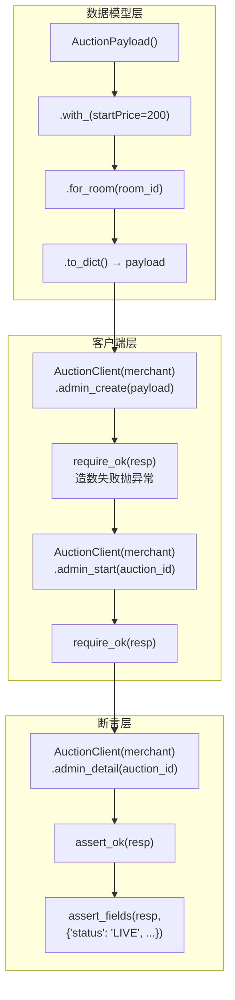

**协同要点**：
1. **payloads 构造请求体**：`AuctionPayload().with_().for_room().to_dict()` 链式配置
2. **clients 发请求**：`admin_create(payload)` + `admin_start(id)` 两步
3. **assertions 保障**：`require_ok` 确保造数成功（失败抛异常），`assert_fields` 验证终态字段

---

# 三、通用工具（support/）

本层提供跨测试域的通用能力：用户池、时间解析、轮询等待、并发执行。

## support/user_pool.py —— 用户池

**定位**：session 级复用已注册 bidder，pytest 与 k6 共享。池子文件 `reports/user_pool.json`，首次运行自动注册 20 个普通用户。JWT exp 过期（7 天）后自动重建。

> 📌 **主播不复用**
> 后端限制一个主播只能建一个直播间（重复建房 400），故主播仍由各用例 function 级注册。池子只存 bidder（role=2）。

### 一、模块级常量

| 常量 | 值 | 含义 |
|---|---|---|
| `POOL_PATH` | `reports/user_pool.json` | 池子文件路径（pytest 与 k6 共享） |
| `BIDDER_COUNT` | `20` | 默认注册 bidder 数量 |
| `PROBE_PATH` | `/api/user/bids` | 探活接口（与 `BidClient.my_bids` 同端点） |

### 二、函数清单

| 函数 | 作用 |
|---|---|
| `_decode_exp(token)` | 解码 JWT 取 exp（过期时间），失败返回 0.0 |
| `_probe_token(token)` | 用 token 调探活接口，**只有 401 才判失效** |
| `_is_valid(pool)` | 双重校验：exp 未过期（留 60s 缓冲）+ 探活通过 |
| `_build_pool(count, password)` | 注册 N 个 bidder，返回 pool dict |
| `ensure_pool(path, password, count, force)` | 池不存在或过期则创建，否则复用 |
| `load_pool(path)` | 加载池子 |
| `get_bidder(pool, index)` | 取第 index 个 bidder，返回带 token 的 `ApiClient` |
| `extend_pool(pool, password, path)` | 追加一个 bidder 并持久化 |
| `get_bidders(pool, count)` | 取前 count 个原始记录（供 k6 tokens.json） |

### 三、ensure_pool + _is_valid 完整流程

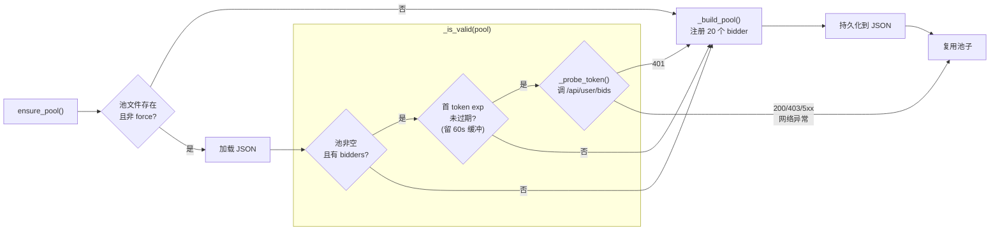

### 四、关键边界

> ⚠️ **特别注意：探活的容错策略**
> `_probe_token` 只有后端明确回 **401** 才判失效。200/403/5xx/网络异常都判有效。
>
> 原因：避免后端不可达或临时故障时反复重建池子。后端 500 时如果判失效，会导致每次测试都重新注册 20 个 bidder，浪费时间且可能因后端故障注册失败。

> 🔑 **为什么需要双重校验**
> - 只看 exp：无法发现"签名密钥轮换"导致的失效（exp 未到但后端已拒认）
> - 只探活：每次都发 HTTP 请求，慢且可能因网络抖动误判
>
> 先 exp（快、本地判断），再探活（慢、但能发现密钥轮换），兼顾速度和准确性。

> 🔑 **池耗尽扩容**
> `extend_pool` 追加一个 bidder 并持久化到 JSON。不静默复用身份（避免并发用例身份冲突）。

> 🔑 **pytest 和 k6 共享**
> `get_bidder(pool, index)` 返回 `ApiClient`（pytest 用）；`get_bidders(pool, count)` 返回原始 dict 列表（k6 用，生成 tokens.json）。

## support/time_util.py —— 时间解析工具

**定位**：统一处理后端返回的 ISO 时间字符串（如 `plannedEndTime` / `actualEndTime` / `newEndTime`）。

### 一、3 个函数

| 函数 | 作用 |
|---|---|
| `parse_iso_dt(value)` | 解析 ISO 字符串为 `datetime`（兼容 `Z` / 显式 offset / 无时区） |
| `seconds_between(later, earlier)` | 两个 ISO 字符串之间的秒数（later - earlier） |
| `seconds_until(end_iso)` | end_iso 到当前时刻的剩余秒数（end - now） |

### 二、关键边界

> 🔑 **`parse_iso_dt` 的时区兼容**
> 后端可能返回 `2026-08-12T10:30:00Z`（Z 后缀）、`2026-08-12T10:30:00+08:00`（显式 offset）、`2026-08-12T10:30:00`（无时区）三种格式。`parse_iso_dt` 把 `Z` 替换成 `+00:00` 后用 `datetime.fromisoformat` 解析，三种都兼容。

> ⚠️ **`seconds_until` 的时区处理**
> 带时区时间用相同时区的当前时间（`datetime.now(end.tzinfo)`）；无时区时间按本机本地时间处理（`datetime.now()`）。
>
> **不能混用时区 naive 和 aware 的 datetime 做减法**，否则 `TypeError`。`seconds_between` 会对两侧做时区对齐。

> ⚠️ **不要用 `time.time()` 做时长比较**
> `time.time()` 受系统时钟调整影响（NTP 同步、手动改时钟）。时长检查应该用 `time.monotonic()`（见 [wait_util.py](file:///d:/project/live_auction_qa/support/wait_util.py)）。`time_util` 只用于解析后端时间字符串，不用于测量耗时。

## support/wait_util.py —— 轮询等待工具

**定位**：替代固定 `time.sleep`，条件满足即返回，超时返回末次观测值由调用方断言。

### 一、核心函数

`wait_until(fetch, predicate, timeout=5.0, interval=0.3)` —— 在 `timeout` 秒内每 `interval` 秒取 `fetch()` 最新值，`predicate(value)` 为真即提前返回。

### 二、循环逻辑

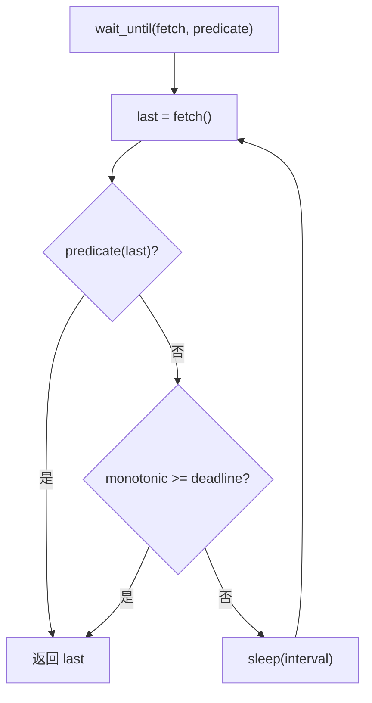

### 三、与 `time.sleep` 的对比

| `time.sleep` | `wait_until` |
|---|---|
| 固定等待，不管条件 | 条件满足立即返回 |
| 超时静默放过 | 超时返回末次值，保留失败信息 |
| 无谓词 | 显式 `predicate`（避免 0/空值被当作假值） |
| 受系统时钟影响 | 用 `time.monotonic()`（不受时钟调整影响） |

### 四、关键边界

> ⚠️ **特别注意：超时不抛异常**
> 超时返回**末次观测值**（`last`），不抛 `TimeoutError`。由调用方 `assert` 暴露期望与实际的差异。这让失败信息更精确（"期望 status=5，实际 status=3"），而不是一个笼统的超时。

> 🔑 **`predicate` 是显式 bool 判定**
> 注释里强调：`predicate` 必须返回 `bool`，不能用真值判断。因为在线人数回落到 0、剩余秒数为 0 等场景下，`if value:` 会误判为假值而继续轮询。必须 `predicate=lambda v: v == 0` 这样写。

> 🔑 **用 `time.monotonic()` 而非 `time.time()`**
> `monotonic` 不受系统时钟调整（NTP 同步、手动改时间）影响。`deadline = time.monotonic() + timeout` 保证超时计算准确。这是 project_memory 里"时长检查用 monotonic time"纪律的来源。

## support/concurrency.py —— 并发执行器

**定位**：线程化并发执行器，用 `threading.Barrier` 保证所有 worker 同时起跑，捕获每个线程的结果。用于"同金额竞争""并发出价"等场景。

### 一、两个核心组件

| 组件 | 角色 |
|---|---|
| `ThreadResult` | 单线程结果快照（`@dataclass`） |
| `ConcurrentRunner` | 并发执行器，barrier 同步 + 超时回收 |

#### 1. `ThreadResult` —— 线程结果

`@dataclass`，5 个字段：

| 字段 | 含义 |
|---|---|
| `success` | 业务是否成功 |
| `http_status` | HTTP 状态码 |
| `biz_code` | 业务码 |
| `data` | 响应数据 |
| `exception` | 线程异常（含 `TimeoutError`） |

#### 2. `ConcurrentRunner` —— 执行器

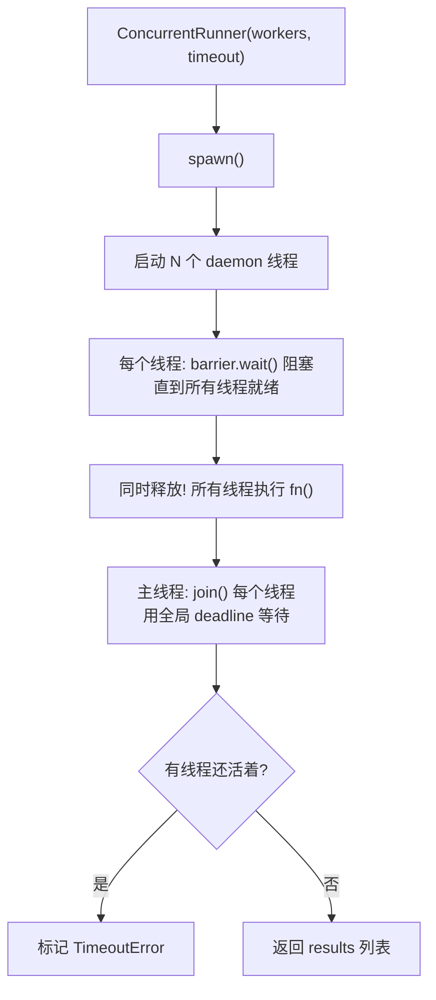

### 二、辅助函数

| 函数 | 作用 |
|---|---|
| `assert_exactly_one_succeeded(results)` | 断言恰好一个成功（用于"同金额竞争"场景） |
| `failed(results)` | 返回所有失败的 `ThreadResult` |

### 三、关键边界

> 🔑 **Barrier 保证"同时起跑"**
> `threading.Barrier(len(workers))` 让所有线程在 `barrier.wait()` 处阻塞，直到最后一个线程到达才同时释放。这模拟了"多个用户同一瞬间出价"的真实场景。

> 🔑 **barrier 必须在 `fn()` 之前**
> `_run` 里顺序是 `barrier.wait()` → `fn()`。如果反过来"先 fn() 再 barrier"，线程 1 可能已经发完请求线程 2 才启动，后端串行处理，**测不出真并发**。barrier 在最前面保证所有线程就绪后才一起冲。

> ⚠️ **特别注意：超时线程标记为 `TimeoutError`，不静默放过**
> `spawn()` 用全局 `deadline = time.monotonic() + timeout` 等待每个线程。超时未结束的线程被标记为 `ThreadResult(exception=TimeoutError(...))`，避免把"线程卡死"误判为"业务拒绝"。

> 🔑 **为什么超时标记 `TimeoutError` 而非 `success=False`**
> "业务被拒绝"（后端正常返回失败码）和"线程卡死"（请求没发出去/没回来）是两回事。如果超时标 `success=False`，会和"业务失败"混在一起，断言"恰一成功"时分不清是"后端拒绝了"还是"线程没跑完"。标记 `TimeoutError` 让两类失败在结果里完全分开。

> 🔑 **全局 deadline 而非每线程独立 timeout**
> 如果每个线程 `join(timeout=30)`，2 个线程最坏等 60 秒。用全局 `deadline = now + 30`，每个线程只等"剩余时间"（`remaining = max(0, deadline - now)`），**总等待不超过 timeout**。线程 1 等了 5 秒结束，线程 2 只剩 25 秒可等。

> 🔑 **`exception` 字段：异常数据化**
> `_run` 里 `except Exception` 捕获所有异常，转成 `ThreadResult(exception=exc)`。这样线程异常**不会冒泡杀掉整个 `spawn`**——调用方拿到的是"1 成功 + 1 异常"的数据，而不是整个方法挂掉。不区分异常类型，全部数据化。

> 🔑 **daemon 线程 + 返回副本**
> 线程设为 `daemon=True`，主进程退出时自动终止。`return list(self.results)` 返回的是**副本**——即使 daemon 线程稍后改了 `self.results[idx]`，也不影响调用方已收到的判定结果。

> ⚠️ **`assert_exactly_one_succeeded` 的含义**
> 同金额竞争场景下，后端只允许一个出价成功。这个函数断言"恰好一个 `success=True`"，多了少了都是 bug。

### 场景协同：等待竞拍进入延时窗口

以"验证延时倒计时触发 DELAYED 事件"为例，展示 time_util + wait_util + assertions 怎么配合：

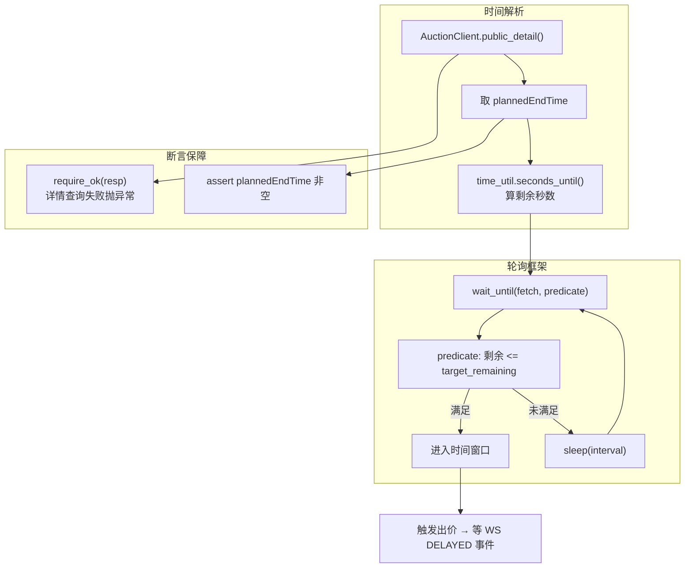

**协同要点**：
1. **time_util 解析时间**：`seconds_until(plannedEndTime)` 算剩余秒数
2. **wait_until 轮询**：`fetch` = 查详情取剩余时间，`predicate` = `剩余 <= target`，条件满足即返回
3. **assertions 保障**：`require_ok` 确保每次详情查询成功，`plannedEndTime` 缺失抛 `AssertionError`
4. **进入窗口后**：触发出价 → WS 等 DELAYED 事件（跨到 ws 层）

### 场景协同：同价竞争恰一请求生效

以 `CON-CCY-001 两用户真实同价竞争恰一请求生效` 为例，展示 concurrency + clients + assertions + user_pool 怎么配合：

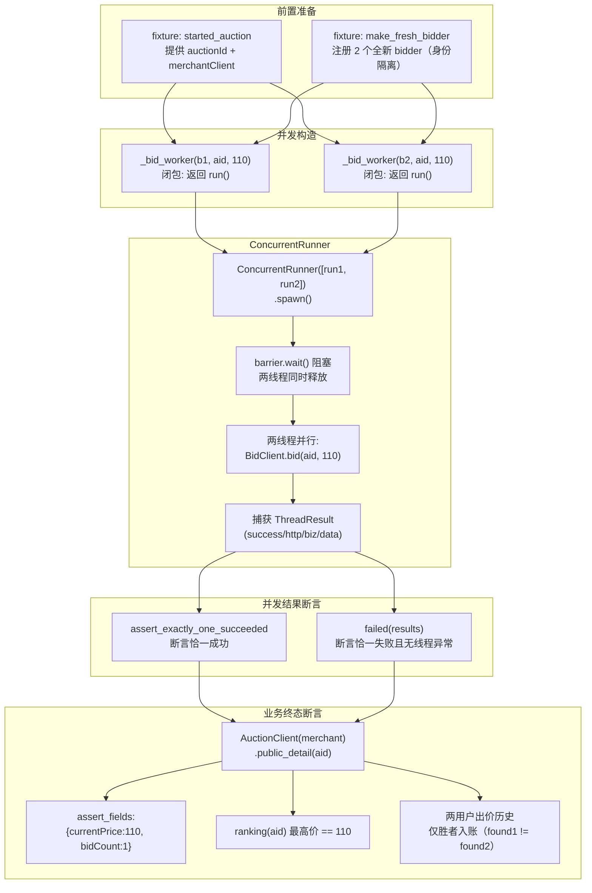

**协同要点**：
1. **fixture 提供隔离身份**：`make_fresh_bidder` 注册两个全新 bidder（不能用池里的，避免历史出价记录干扰）
2. **concurrency 保证同时起跑**：`barrier.wait()` 让两个线程阻塞到都就绪才同时释放，模拟"同一瞬间出价"
3. **clients 层发请求**：每个 worker 内部调 `BidClient.bid()`，返回 `ThreadResult` 快照（success/http_status/biz_code/data）
4. **assertions 分两层**：
   - 并发结果层：`assert_exactly_one_succeeded` 验证"恰一成功"，`failed()` 验证"败者无线程异常"
   - 业务终态层：`assert_fields` 验证 currentPrice/bidCount，`Decimal` 精确比较金额，用户历史断言"仅胜者入账"
5. **金额用 Decimal 比较**：浮点精度问题，`Decimal(str(top_amount)) == Decimal(str(SAME_AMOUNT))`

> 🔑 **为什么 worker 用闭包**
> `_bid_worker(client, auction_id, amount)` 返回一个 `run()` 闭包，捕获参数。`ConcurrentRunner` 接收的是 `list[Callable]`，每个 callable 无参、返回 `ThreadResult`。这样把"出价参数"和"执行逻辑"分开，runner 只管"同时执行"。

> 🔑 **为什么不能跨线程共享 `requests.Session`**
> `requests.Session` 不是线程安全的。同一用户并发需要 `_same_identity_client()` 克隆一个独立 session 的 `ApiClient`（同 token，不同 session）。CON-CCY-001 用的是两个不同用户，所以天然隔离；CON-RPT-001 同身份重复才需要克隆。

---

# 四、业务编排（scenarios/）

本层把 clients 层的单独请求串成完整业务前置链。

## scenarios/auction_lifecycle.py —— 业务编排链

**定位**：把 clients 层的单独请求串成完整业务前置链（注册主播 → 建直播间 → 开播 → 建竞拍 → 开始竞拍），测试 fixture 通过一行代码拿到完整上下文。

### 一、两个核心组件

| 组件 | 角色 |
|---|---|
| `AuctionContext` | frozen dataclass（@dataclass(frozen=True)），生命周期上下文快照 |
| `AuctionLifecycle` | 链式 builder，复用 clients 逐步建链 |

#### 1. `AuctionContext` —— 上下文快照

`@dataclass(frozen=True)`，5 个字段：

| 字段 | 含义 |
|---|---|
| `merchant_client` | 带 token 的 `ApiClient`（主播身份） |
| `merchant_token` | JWT token |
| `merchant_id` | 主播 userId |
| `room_id` | 直播间 ID |
| `auction_id` | 竞拍 ID（可选，未建竞拍时为 None） |

`to_fixture_dict()` 转 camelCase dict。

#### 2. `AuctionLifecycle` —— 链式 builder

5 个链式方法（每步返回 `self`）+ 3 个收尾方法（返回 `AuctionContext`）+ 3 个便捷方法（返回 `dict`）。

### 二、链式调用流程

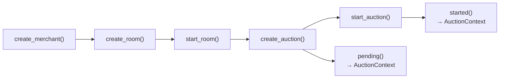

5 个链式方法的依赖关系：

| 方法 | 前置 | 做什么 |
|---|---|---|
| `create_merchant()` | 无 | `register_merchant()` 注册主播 |
| `create_room(title)` | `create_merchant` | `RoomClient.create()` 建直播间 |
| `start_room()` | `create_room` | `RoomClient.start()` 开播 |
| `create_auction(payload)` | `create_room` | `AuctionClient.admin_create()` 建竞拍 |
| `start_auction()` | `create_auction` | `AuctionClient.admin_start()` 开始竞拍 |

### 三、便捷方法

一步到位，返回 `dict`（经 `to_fixture_dict()` 转 camelCase）：

| 方法 | 链到哪一步 | 返回 |
|---|---|---|
| `create_live_room(title)` | `start_room` | `{merchantClient, merchantToken, merchantId, roomId}` |
| `create_pending_auction(**payload)` | `create_auction`（未 start） | 同上 + `auctionId` |
| `create_started_auction(**payload)` | `start_auction` | 同上 + `auctionId` |

### 四、关键边界

> 🔑 **`require_ok` 造数，失败抛异常**
> 每个链式方法内部用 `require_ok` 调 clients。造数失败抛 `ApiResponseError`，让测试直接挂，不走断言流程。这是"前置失败"不是"业务失败"。

> 🔑 **`assert` 检查前置条件**
> 每个方法开头用 `assert self._xxx is not None` 检查前置步骤是否已完成。如 `create_room` 前断言 `create_merchant` 已调用。漏步直接 `AssertionError`。

> 🔑 **`create_auction` 的 payload 覆盖**
> `payload` 参数是 `Mapping | None`。None 时用 `default_auction_payload()` 默认值；传 dict 时覆盖默认值（`.update()`）。`roomId` 始终由 builder 自动填入，不从 payload 读。

> ⚠️ **`AuctionContext` 是 frozen**
> `@dataclass(frozen=True)` 不可变。拿到 context 后不能修改字段，只能读。保证测试拿到的上下文不会被意外篡改。

## scenarios/auction_waits.py —— 竞拍时间等待

**定位**：等待竞拍进入指定剩余时间窗口。是 WebSocket 延时事件测试（如延时倒计时触发）的前置工具。

### 一、核心函数

`wait_until_remaining(auction_id, target_remaining, client, timeout, interval)` —— 轮询竞拍详情，直到剩余秒数 ≤ `target_remaining`。

### 二、调用链

组合了三个工具：`require_ok` + `seconds_until` + `wait_until`：

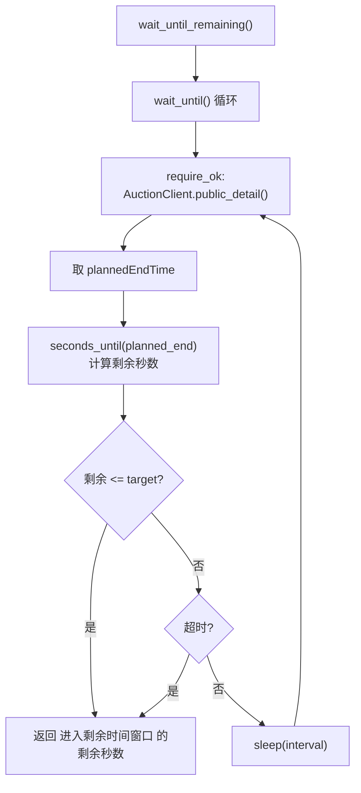

### 三、关键边界

> 🔑 **为什么需要轮询而不是 sleep**
> 竞拍 `plannedEndTime` 由后端计算，受网络延迟、后端时钟偏差影响，无法精确预知"何时进入目标窗口"。固定 `sleep` 要么等太久（浪费时间），要么等不够（状态未到）。轮询能条件满足即返回。

> ⚠️ **详情查询失败立即抛异常**
> `require_ok` 在轮询内部调用。如果 `public_detail` 返回失败（如竞拍被取消），直接抛 `ApiResponseError`，不静默重试。

> 🔑 **`plannedEndTime` 缺失抛 `AssertionError`**
> 如果详情响应里没有 `plannedEndTime` 字段，抛 `AssertionError("竞拍详情缺少 plannedEndTime")`。这是数据契约校验，不是传输错误。

### 场景协同：fixture 如何拿到一个已开始竞拍

以 `started_auction` fixture 为例，展示 scenarios + clients + assertions + user_pool 怎么配合：

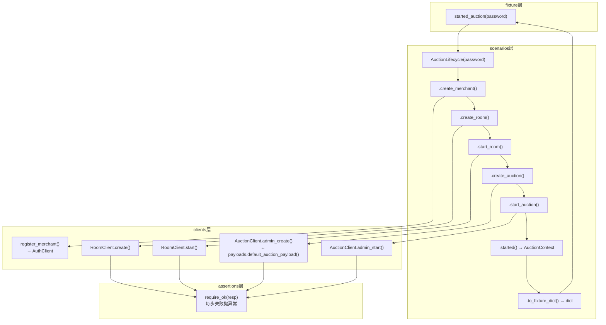

**协同要点**：
1. **fixture 一行调**：`AuctionLifecycle(password=password).create_started_auction()`
2. **scenarios 链式执行**：5 步顺序调用，每步都依赖前一步的 `self._xxx`
3. **clients 层发请求**：每步调对应客户端方法
4. **assertions 层保障**：`require_ok` 包裹每步，造数失败直接抛异常
5. **payloads 层提供数据**：`create_auction` 内部调 `default_auction_payload()` 获取默认请求体

---

# 五、WebSocket 实时通信（ws/）

本层处理 STOMP over WebSocket 连接、订阅、事件谓词匹配。与 REST 层形成对照：REST 发请求看响应，WS 订阅等推送。

## ws/stomp_client.py —— WebSocket 客户端

**定位**：STOMP over WebSocket 客户端，用于直播间实时事件订阅（竞拍状态变更、出价推送、被超价通知）。是项目里跟 REST 完全不同的第二条通信脉络。

### 一、两个核心组件

| 组件 | 角色 |
|---|---|
| `StompMessageListener` | 消息收集器，收 MESSAGE/ERROR/RECEIPT 帧，提供谓词等待 |
| `StompWebSocketClient` | 连接管理器，建连 / 订阅 / 发送 / 断连 |

### 二、通信流程

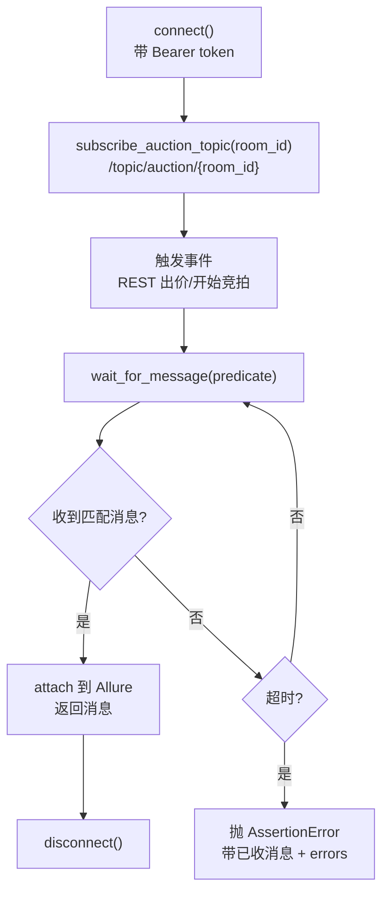

### 三、StompMessageListener 方法

| 方法 | 作用 |
|---|---|
| `on_message(*args)` | 收到 MESSAGE 帧，解析 JSON 存入 `messages` 列表 |
| `on_error(*args)` | 收到 ERROR 帧，存入 `errors` 列表 |
| `on_receipt(*args)` | 收到 RECEIPT 帧，存入 `receipts` 集合 |
| `clear()` | 清空所有收集 |
| `wait_for_receipt(receipt_id, timeout)` | 等待订阅确认，**超时不抛异常** |
| `wait_for(predicate, timeout, interval)` | 谓词等待，**超时抛 AssertionError** |

### 四、StompWebSocketClient 方法

| 方法 | 作用 |
|---|---|
| `connect()` | 建立 WS 连接，带 `Authorization: Bearer {token}` / `accept-version: 1.2` / `heart-beat` |
| `subscribe_auction_topic(room_id)` | 订阅 `/topic/auction/{room_id}`（直播间事件） |
| `subscribe_user_queue(queue)` | 订阅 `/user/queue/outbid`（个人被超价通知） |
| `wait_for_message(predicate, timeout)` | 等待匹配谓词的消息，**attach 到 Allure** |
| `send(destination, body)` | 发送消息（如出价到 `/app/bid`），**attach 到 Allure** |
| `disconnect()` | 断开连接 |

### 五、关键边界

> ⚠️ **特别注意：`wait_for` 超时抛异常**
> 跟 [wait_util.py](file:///d:/project/live_auction_qa/support/wait_util.py) 的 `wait_until` **不同**！
>
> | 工具 | 超时行为 | 适用场景 |
> |---|---|---|
> | `wait_until` | 返回末次值，不抛异常 | REST 轮询（由调用方 assert） |
> | `listener.wait_for` | **抛 `AssertionError`**，带已收消息 + errors | WS 事件等待（没收到就是失败） |
>
> WS 事件没收到 = 后端没推送 = 测试失败，所以直接抛异常更合理。异常消息里带已收消息数和内容，方便诊断"是没推送，还是推了但不匹配"。

> 🔑 **receipt 不阻塞等待**
> 后端可能不返回 RECEIPT 帧。`wait_for_receipt` 超时后只记日志（"按服务端不支持 RECEIPT 继续执行"），不抛异常。订阅不会因为后端不回 RECEIPT 而卡住。

> 🔑 **消息收集模式**
> Listener 收到的**所有**消息存在 `messages` 列表里，`wait_for` 遍历列表找匹配谓词的。不匹配的消息也保留，超时异常里会附带已收消息内容，方便诊断。

> 🔑 **两个订阅目的地**
> - `/topic/auction/{room_id}` — 直播间广播（竞拍状态变更、出价推送）
> - `/user/queue/outbid` — 个人队列（你被别人超价了）
>
> 出价本身通过 `send("/app/bid", body)` 发送到 `/app/bid`，不是订阅目的地。

> 🔑 **配置从 yaml 读**
> WS 地址、超时、心跳、出价目的地都从 `config.yaml` 的 `STOMP` 节点读。环境变量可覆盖 WS 地址（`AUCTION_WS_URL`）。

## ws/events.py —— 事件谓词工厂

**定位**：给 `StompMessageListener.wait_for()` 提供精确匹配条件的谓词函数。防止"收到一条消息"被误认为"收到正确消息"。

### 一、核心机制

```python
# 谓词 = 返回 bool 的函数，给 wait_for(predicate) 用
def bid_event(item_id=None, price=None) -> Callable[[dict], bool]:
    def predicate(msg: dict) -> bool:
        if not _matches_event(msg, EventType.BID):   return False
        if not _item_matches(msg, item_id):           return False
        if price is not None and float(...) != price:  return False
        return True
    return predicate
```

**两步匹配**：先匹配事件类型，再匹配业务字段。任一不满足就 `False`，全部满足才 `True`。

出价接口是`room_id`标识，因此需要`item_id`匹配。

### 二、事件类型清单

| 谓词工厂 | EventType | 额外校验字段 | 说明 |
|---|---|---|---|
| `bid_event(item_id, price)` | BID | itemId + price | 出价推送 |
| `started_event(item_id)` | STARTED | itemId | 竞拍开始 |
| `sold_event(item_id)` | SOLD | itemId | 竞拍成交 |
| `ended_event(item_id)` | ENDED | itemId | 竞拍流拍 |
| `cancelled_event(item_id)` | CANCELLED | itemId | 竞拍取消 |
| `delayed_event(item_id)` | DELAYED | itemId + **newEndTime 非空** | 延时窗口触发 |
| `outbid_event(item_id)` | OUTBID | itemId | 被超价通知（点对点队列） |
| `online_event(room_id)` | ONLINE | roomId | 在线人数变更 |

### 三、关键边界

> 🔑 **兼容两种消息形状**
> 后端可能用 `msg.get("event")` 或 `msg.get("type")` 表示事件类型。`_matches_event` 两个都试：`msg.get("event") == event or msg.get("type") == event`。

> 🔑 **参数为 None 时不校验**
> `item_id=None` 表示"不关心是哪个竞拍的事件"。`price=None` 表示"不校验出价金额"。传了具体值才校验。这种设计让谓词既能精确匹配，也能宽松匹配。

> 🔑 **delayed_event 额外校验 newEndTime**
> 延时事件不仅要事件类型匹配，还要 `msg.get("newEndTime") is not None` —— 确保后端真的返回了新的结束时间。

### 附：WebSocket 与 STOMP 的关系

**不是同一层的东西，是上下层关系**：

```
WebSocket  ← 传输层（提供字节流双工通道）
   ↑
STOMP      ← 协议层（定义帧格式和交互规则）
```

| | WebSocket | STOMP |
|---|---|---|
| 层级 | 传输层 | 协议层（跑在 WS 之上） |
| 做什么 | 建立持久双向连接 | 定义帧格式（CONNECT/SUBSCRIBE/MESSAGE/SEND...） |
| 类比 | 卡车（能双向运货） | 快递分拣系统（定义投递地址、订阅规则） |

**STOMP 核心帧与项目代码的对应**：

| 帧 | 方向 | 项目代码 |
|---|---|---|
| CONNECT | 客户端 → 服务器 | `conn.connect(headers={Authorization, accept-version, heart-beat})` |
| SUBSCRIBE | 客户端 → 服务器 | `subscribe_auction_topic(room_id)` → `/topic/auction/{room_id}` |
| MESSAGE | 服务器 → 客户端 | `on_message()` 回调接收 |
| SEND | 客户端 → 服务器 | `send("/app/bid", body)` |
| RECEIPT | 服务器 → 客户端 | `on_receipt()` 回调（后端可能不回） |
| ERROR | 服务器 → 客户端 | `on_error()` 回调 |
| DISCONNECT | 客户端 → 服务器 | `disconnect()` |

### 附：WS 测试完整流程

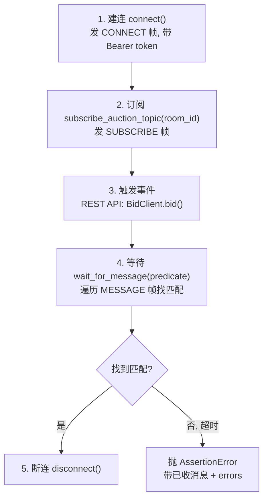

> ⚠️ **关键理解**：第 3 步事件通过 **REST API 触发**，不是通过 WebSocket 发送。出价是 HTTP POST，后端处理后通过 WebSocket 推送事件给订阅者。WebSocket 在这里是**接收通道**，不是**触发通道**。

**两条出价路径**：

| 路径 | 触发方式 | 用在哪 |
|---|---|---|
| REST | `BidClient.bid()` → HTTP POST | 功能测试（要验证 HTTP 响应） |
| WS | `send("/app/bid", body)` → STOMP SEND 帧 | k6 性能测试（少一次 HTTP 往返） |

### 场景协同：验证一次出价的实时推送

以"出价后收到 BID 事件推送"为例，展示 ws 层 + clients 层 + scenarios 层怎么配合：

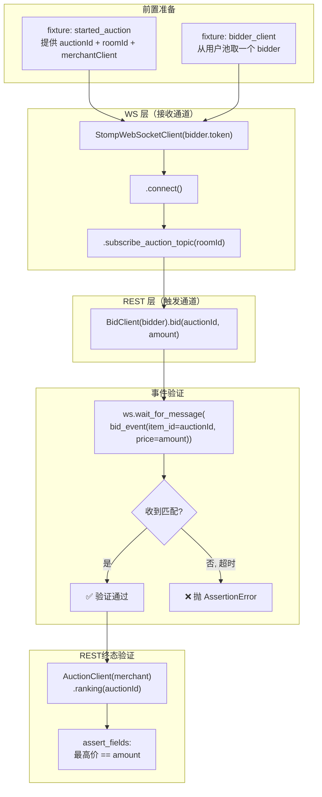

**协同要点**：
1. **REST 触发 + WS 接收**：出价通过 REST POST 触发，事件通过 WS 推送接收
2. **events 谓词精确匹配**：`bid_event(item_id=auctionId, price=amount)` 确保收到的消息是"这个竞拍的、这个金额的 BID 事件"
3. **WS + REST 联合验证**：WS 验证"事件推了"，REST 验证"终态正确"（ranking 里最高价确实变了）
4. **fixture 提供一切**：`started_auction` 给出 auctionId/roomId/merchantClient，`bidder_client` 给出出价人

---

# 六、测试夹具（tests/fixtures/）

本层把所有"零件"（clients、scenarios、user_pool）组装成测试用例直接用的资源。测试函数参数里的 `merchant_client`、`started_auction`、`bidder_allocator` 都来自这里。

### 一、三个文件分工

| 文件 | 职责 | 核心 fixture |
|---|---|---|
| `users.py` | 用户池、客户端工厂 | `bidder_pool` / `bidder_allocator` / `merchant_client` / `make_fresh_bidder` |
| `resources.py` | 自动清理 | `resource_cleanup`（autouse） |
| `lifecycle.py` | 业务前置链 | `live_room` / `started_auction` / `pending_auction` |

### 二、fixture 依赖关系

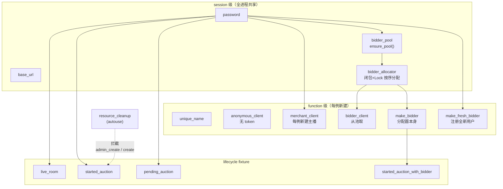

### 三、fixture 清单

**users.py**：

| fixture | scope | 作用 |
|---|---|---|
| `base_url` | session | 后端地址（读配置） |
| `password` | session | 默认密码 `123456` |
| `bidder_pool` | session | 调 `ensure_pool()` 初始化 20 个 bidder |
| `bidder_allocator` | session | 闭包分配器，按序分配，池耗尽 `extend_pool` |
| `unique_name` | function | `lambda prefix: unique_username(prefix)` |
| `anonymous_client` | function | 无 token 的 `ApiClient()` |
| `make_merchant` | function | 工厂：每次调注册新主播 |
| `merchant_client` | function | 每例新建主播（后端限制一主播一房间） |
| `bidder_client` | function | 从池取一个 bidder |
| `make_bidder` | function | 同 `bidder_allocator`（分配器本身） |
| `make_fresh_bidder` | function | 注册全新 bidder（身份敏感用例） |

**resources.py**：

| fixture | scope | 作用 |
|---|---|---|
| `resource_cleanup` | function (autouse) | monkeypatch 拦截创建方法，记录资源，结束时逆序清理 |

**lifecycle.py**：

| fixture | scope | 作用 |
|---|---|---|
| `live_room` | function | 建主播→建房间→开播 |
| `started_auction` | function | 完整链到已开始竞拍 |
| `pending_auction` | function | 完整链到待开始竞拍 |
| `started_auction_with_bidder` | function | 已开始竞拍 + 注入 bidder 信息 |

### 四、resource_cleanup 工作原理

```mermaid
flowchart LR
    subgraph 测试前
        A["monkeypatch 拦截<br/>AuctionClient.admin_create<br/>RoomClient.create"] --> B["测试执行"]
    end
    subgraph 测试中
        B --> C["每次创建资源<br/>被拦截函数记录"]
    end
    subgraph 测试后["测试后 (yield 之后)"]
        C --> D["逆序去重清理"]
        D --> E["先取消竞拍"]
        E --> F["再停止直播间"]
    end
```

### 五、关键边界

> 🔑 **session vs function scope**
> - `bidder_pool` / `bidder_allocator` 是 **session 级** —— 全进程共享，不重复注册
> - `merchant_client` 是 **function 级** —— 每个测试新建，因为后端限制一个主播只能有一个直播间

> 🔑 **merchant_client 每例新建**
> 后端限制一主播一房间。如果 session 级共享主播，第一个测试建了房间后，后续测试再建房间会冲突。所以每个测试自己注册新主播。

> 🔑 **make_fresh_bidder vs bidder_client**
> - `bidder_client` —— 从池取，可能被多个测试共用（历史出价记录会干扰）
> - `make_fresh_bidder` —— 注册全新用户，**身份或历史敏感用例**用（如"首次出价""无历史记录"场景）

> ⚠️ **resource_cleanup 是 autouse**
> 每个测试自动启用，不需要在参数里声明。它通过 `monkeypatch.setattr` 拦截**类方法**（不是实例方法），所以所有用例创建的资源都会被记录。

> 🔑 **清理顺序：先竞拍后房间**
> 逆序清理，先取消竞拍（依赖直播间还活着），再停止直播间。清理函数 `try/except` 不抛异常 —— 尽力清理，不让清理失败影响测试结果。

> 🔑 **去重用 `id(client)` 而非 `==`**
> `ApiClient` 没实现 `__eq__`，默认按对象身份比较。用 `(id(client), resource_id)` 元组去重，避免同一客户端同一资源被清理两次。

### 场景协同：一个测试用例从 fixture 到断言的完整流程

以"验证出价成功"的测试为例，展示所有层怎么配合：

```mermaid
flowchart TD
    subgraph 测试函数["测试函数 def test_bid_xxx(started_auction, bidder_client)"]
        A["参数注入"]
    end
    subgraph fixture层["fixture 层（注入前）"]
        B["started_auction fixture:<br/>AuctionLifecycle.create_started_auction()<br/>→ {auctionId, roomId, merchantClient, ...}"]
        C["bidder_client fixture:<br/>bidder_allocator() 从池取"]
        D["resource_cleanup fixture:<br/>monkeypatch 拦截 admin_create / create"]
    end
    subgraph 客户端层
        E["BidClient(bidder_client).bid(auctionId, amount)"]
    end
    subgraph 断言层
        F["assert_ok(resp, '出价成功')"]
        G["AuctionClient(merchantClient).ranking(auctionId)"]
        H["assert_fields: 最高价 == amount"]
    end
    subgraph 清理层["测试后（自动）"]
        I["resource_cleanup:<br/>逆序取消竞拍 → 停止直播间"]
    end

    B & C & D --> A
    A --> E
    E --> F
    F --> G --> H
    H --> I
```

**协同要点**：
1. **fixture 注入一切**：`started_auction`（业务前置链）、`bidder_client`（用户池）、`resource_cleanup`（自动清理，不需要声明）
2. **测试函数极简**：只写"调接口 + 断言"，不写任何前置/清理代码
3. **多层配合**：fixture（造环境）→ clients（发请求）→ assertions（断言）→ fixture（自动清理）
4. **resource_cleanup 无感**：测试不感知清理，但所有创建的竞拍和直播间都会被自动取消/停止

---

# 七、性能测试（load/）

本层是项目的第三条脉络：k6 外部进程发压，Python 负责造数据、注入参数、收集结果。与功能测试完全独立。

## load/runner.py —— 性能测试调度

**占位**，待补充。

### 场景协同：k6 性能测试链路

```mermaid
flowchart TD
    subgraph Python造数["Python 造数"]
        A["AuctionLifecycle.create_started_auction()<br/>造一个已开始竞拍"]
        B["ensure_pool() 取 N 个 bidder token<br/>写 tokens.json"]
    end
    subgraph k6压测["k6 压测"]
        C["k6 run bid_concurrent.js<br/>注入 ITEM_ID / ROOM_ID / TOKENS_FILE<br/>/ BASE_URL / WS_URL / BID_DESTINATION"]
        D["k6 内部:<br/>读 tokens → 并发出价"]
        E["--summary-export → JSON"]
    end
    subgraph 结果收集["Python 结果收集"]
        F["write_run_metadata()<br/>写 .meta.json（场景/时间/后端指纹）"]
        G["summarize.parse()<br/>解析 k6 JSON"]
        H["summarize.write_markdown()<br/>写 .md 摘要"]
    end
    subgraph 清理
        I["取消竞拍 → 停止直播间"]
    end

    A & B --> C
    C --> D --> E
    E --> F & G
    G --> H
    H --> I
```

**协同要点**：
1. **Python 造数**：用 scenarios 层造竞拍 + user_pool 层取 bidder
2. **k6 发压**：外部进程，通过环境变量注入参数（不走 Python clients）
3. **Python 收结果**：解析 k6 JSON，写 Markdown 摘要 + 元数据
4. **三条链路共享 user_pool**：pytest 功能测试和 k6 性能测试共用 `reports/user_pool.json`

---

<!-- 后续可追加的章节：
- conftest.py —— session hook（banner / 失败 attach / 追溯矩阵 / result.txt）
- run.py —— 一键入口（allure generate + 改标题）
- support/traceability.py —— @case 装饰器 + AST 扫描
- .github/workflows/ —— CI 流水线
-->
